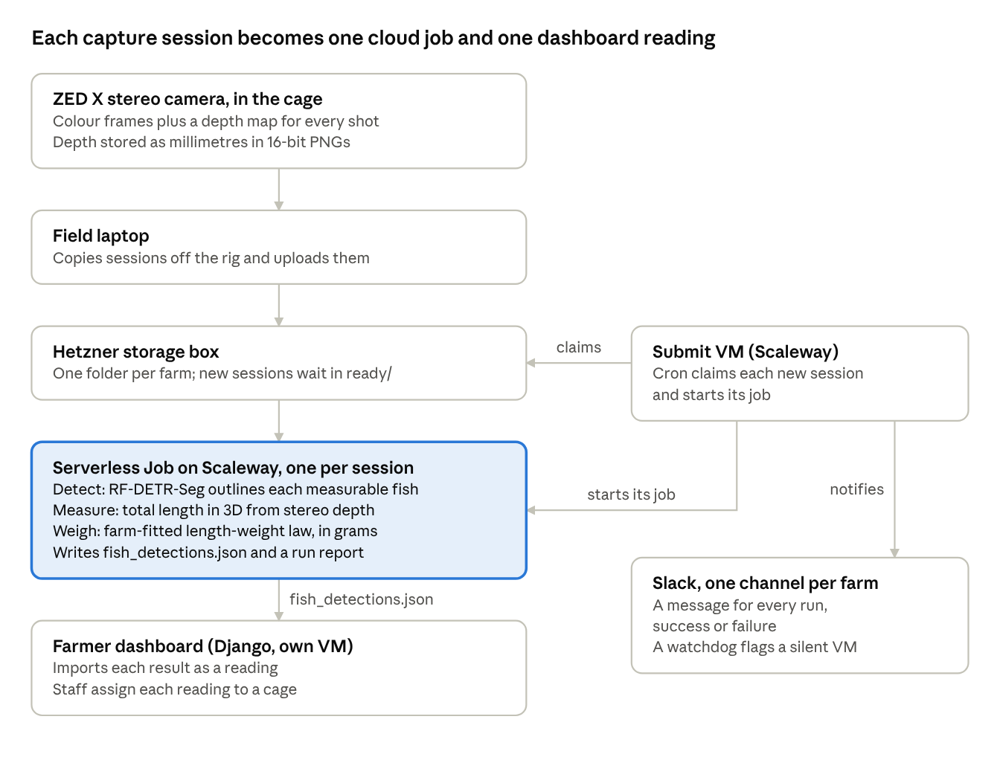

# Niloscale case study

Floris van Rijn · September 2026

## Building Niloscale

Nile tilapia is the world's second most produced freshwater fish after grass carp, with 5.3 million tonnes in 2022 ([FAO, 2024](https://openknowledge.fao.org/3/cd0683en/online/sofia/2024/world-fisheries-aquaculture-production.html)). In raising tilapia feed is the biggest cost of production: in cage culture, around two thirds of the total cost can be attributed to feed ([Brande et al., 2023](https://pmc.ncbi.nlm.nih.gov/articles/PMC10279780/)).

That is why farmers watch two numbers: the average body weight (ABW) of their fish, and the feed conversion ratio (FCR), the kilograms of feed it takes to add one kilogram of fish. Here tilapia does well. Beef cattle need 6 to 10 kg of feed per kilogram gained, pigs 2.7 to 5 and chickens 1.7 to 2. Tilapia needs 1.4 to 2.4 ([Fry et al., 2018](https://iopscience.iop.org/article/10.1088/1748-9326/aaa273)), and a well-run cage gets down to around 1.3. It's one of the reasons tilapia is farmed so widely.

To track both numbers, farms weigh a sample from every cage about every two weeks. That means netting around 2,000 fish from a cage of 200,000 and weighing them by hand, which takes a crew of 15 to 20 people. It is slow, it stresses the fish, and it only ever measures about 1-3% of the cage.

Niloscale replaces the net with a camera. A stereo camera films the fish as they swim past. My trained computer vision algorithm then finds every fish that is fully visible and side-on, measures its length in 3D and converts that length and surface area mesh into a weight. The farmer gets the ABW and a weight histogram for each cage, and fish no longer have to be harmed in the weighing process.

I started TilapAI in 2023 and write all of the software from the capture scripts on the camera to the farmer dashboard as well as building the hardware out of commercial products. Our farm partner is one of Africa's largest tilapia farms, spanning several countries. The first field test ran in March 2026, and the second version, rebuilt around what that test taught us, goes back into the water in November.

This page covers the engineering behind it.

## How it fits together



Only the rig and the laptop live in the field. Everything after the storage box runs on its own and reports to Slack.

## Decisions and mistakes

### Proven tools, simple field kit

Niloscale is a one person company, so every part has to keep working when I'm not watching it. Wherever a proven tool could do the job, I used it instead of something clever.

The kit at the farm is deliberately simple. The camera box only captures. Once a day, on the boat, a laptop joins the box's Wi-Fi and copies the new sessions. Later, wherever there is internet, it uploads them with rsync, checks them against the local copy and only then hands them to processing. Farm internet is slow and drops out, and rsync has done this job for decades: an interrupted upload picks up where it stopped. Sessions are only deleted from the box once the laptop has sent them and a week has passed.

Everything that can go wrong in software runs in the cloud, where I can fix it without flying to the farm: one plain container per session, results as JSON files and a Django dashboard on a single VM. None of it is new and all of it is well documented.

### European providers only

All compute and storage runs on European providers: Hetzner for storage and the annotation server, Scaleway for processing, model weights, secrets and the GPUs I rent for training. The entire project is built consciously on the use of EU computation. Contrary to the proven tools decision, this has cost more work than simply relying on one of the giant cloud providers. An example of this is GCP's batch job allowing serverless GPU runs compared to hand-crafting that technology for Scaleway. This choice is one I've been happy to champion and continue to support.

### Depth as PNG, not floats - reducing video size by 10x

A small decision with a big effect. The camera's depth maps were first saved as 32-bit floats, and they made up 95% of a session: about 35 GB for two hours of capture. Floats carry sub-millimetre noise in their last bits, so zipping them saved only about 20%. Rounding depth to whole millimetres and saving it as a 16-bit PNG made the depth maps 18 to 33 times smaller and a whole session about 10 times smaller, from 35 GB to 3.4 GB. That matters when every session has to leave the farm over a limited connection. Nothing measurable was lost: the stereo camera's own error is 10 to 40 mm, and on the same fish, weights moved by at most 1 g and session ABW by less than 0.2%.

### The rig and the first dataset

<!-- Photo of the first capture rig goes here -->

The first footage came from an Insta360 camera in September 2025. Then the first rig went to a farm in Uganda for the March 2026 field test: a Luxonis OAK-D 4D stereo camera and a small computer in a custom housing, with lighting, powered from the surface.

I host CVAT, the open-source annotation tool, on a Hetzner GPU server, and labelled every measurable fish by hand in about 2,200 images. I split the data by video and session, so near-identical frames from one clip could never end up in both training and validation. About 650 images went to validation, and three Insta360 videos stayed completely unseen for testing. Once the first model was good enough, I ran it inside CVAT to pre-label new frames, which turned most of the labelling into deleting false positives.

### Choosing a detector

I trained YOLO11-seg first. I knew it well, and it was the quickest way to find out whether a strong, widely used commercial model could pick these fish out at all. It could. But YOLO11 is AGPL-licensed, and running it inside a commercial product needs an enterprise licence. I wanted a permissively licensed model that at least matched it, so I trained three instance-segmentation models on the same dataset and scored them with one evaluator (pycocotools mask AP), so the numbers were comparable.

RF-DETR-Seg scored 0.737 mask mAP, against 0.650 for YOLO11-seg and 0.626 for RTMDet-Ins. On footage from our older OAK-D camera, which YOLO handled worst, it was 0.775 against 0.528. RF-DETR is Apache-2.0, so the licence question went away too. It is 2.4 times slower than YOLO on a CPU (393 ms against 163 ms a frame), which doesn't matter when processing can run overnight and farmers do not require real-time results.

### Labelling for a new camera

The ZED replaces the cameras our training data came from, and a model loses accuracy on a camera it hasn't seen. To decide how many ZED frames to label, I rehearsed the switch with data I already had, holding the OAK-D camera out as if it were new:

| Frames from the held-out camera in training | Mask mAP on that camera |
| --- | --- |
| None | 0.666 |
| 50, hand-labelled | 0.748 |
| 150, hand-labelled | 0.775 |
| All of them (production model) | 0.836 |

Self-training on 236 pseudo-labelled frames scored 0.703 and 0.743 with two seeds, too unstable to rely on. So the plan is about 150 hand-labelled ZED frames from the November field test.

## How the code is built

Everything lives in one repository: the capture scripts on the camera box, the field scripts for the laptop, the processing container, deployment and monitoring. Each part has its own README.

Values that change live in data, not code. Each detector and each length-weight law is a small JSON card, and a new model or law gets a new card rather than an edit, so old results stay reproducible. The Docker build checks the model weights against the checksum on their card. Weights and credentials never go into git.

The output file is a contract. fish\_detections.json carries a schema version, and a test builds a real example that the dashboard repository imports in its own tests, so a breaking change fails in both places. There are 194 tests in total, including integration tests on real video. When something goes wrong, the pipeline degrades instead of failing: a corrupt depth map drops only that frame's fish and counts the rejection, a fish that can't be measured is recorded as null rather than zero, and every session gets a small run report, failures included, which feeds a Slack message per run.

The infrastructure is small and boring on purpose. Processing runs on CPUs; GPUs are rented by the hour for training and deleted afterwards. Secrets live in Scaleway's Secret Manager, the machine that starts jobs has a key that can do nothing else, the jobs check the storage server's SSH host key, and the dashboard runs on its own VM so a compromise there can't reach the pipeline.

## What's next

The second-generation rig goes back into the water in November. The next milestones are an underwater known-length study, about 150 labelled ZED frames for the detector, and ABW checked against the farm's own weighings. Until those are done, I don't quote an accuracy figure.

If you'd like to see the code, I'm happy to walk you through it on a call.

## Code excerpts

Four short excerpts that show how the code works without giving the pipeline away. The checksum is cut short, and the farm's name and the law's coefficients are left out.

A detector card. The model's size, resolution and threshold travel together, and the Docker build checks the weights against the checksum.

```json
{
  "id": "golden_tilapia_rfdetr_seg_m_768_v2",
  "size": "medium",
  "resolution": 768,
  "conf_threshold": 0.65,
  "weights_sha256": "aa9449cb...",
  "source": "Sept 2026 RF-DETR-Seg sweep winner.",
  "status": "Default. conf_threshold checked at 768 px on the rfdetr_next valid split: P 0.76 / R 0.82."
}
```

The loader refuses a model that didn't take the card's resolution. Checkpoints don't store the resolution they were trained at, so without this check a model can silently run at the wrong one.

```python
model = model_cls(pretrain_weights=str(card.weights_path), device="cpu",
                  resolution=card.resolution)
if getattr(model.model, "resolution", None) != card.resolution:
    raise RuntimeError(f"{card.model_class} loaded at {model.model.resolution} px, "
                       f"but card '{card.id}' says {card.resolution} px")
```

A length-weight law card. The status line says what hasn't been checked yet.

```json
{
  "id": "farm_harvest_tl_nls_2026-09-24_v1",
  "formula": "weight_g = a * total_length_cm ** b",
  "length_type": "total",
  "calibration_range_cm": [16.7, 41.2],
  "source": "129 harvest fish from the partner farm, weighed and measured nose to tail tip, received 2026-09-24. Nonlinear least squares on grams, all records kept.",
  "status": "Provisional default. Leave-one-fish-out MAE 36 g (FishBase: 87 g). Not yet checked on independent cages or dates."
}
```

The contract with the dashboard. A test builds a real results file from these fields, and the dashboard's own tests import the same file.

```python
# What dashboard/importer.py reads. Renaming or removing one of these breaks the import.
DASHBOARD_READS = {
    "top level": ["schema_version", "source_directory", "model", "capture", "weight_summary"],
    "capture": ["session", "started_at", "clock_synchronized"],
    "weight_summary": ["n_measurements", "abw_g", "median_g", "std_g", "min_g", "max_g",
                       "mean_length_mm", "histogram", "lwr_model"],
}
```
